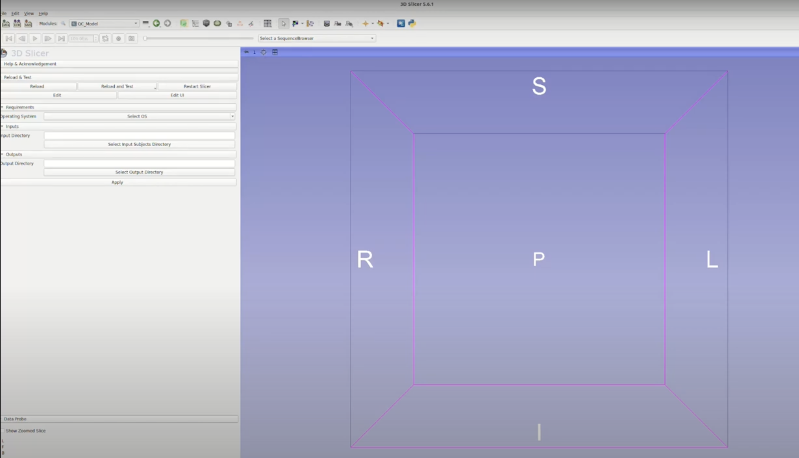

# Project Description

<!-- Add a short paragraph describing the project. -->

**ShapeAXI** is a shape analysis package that regroups many AI networks which use analysis via transformer networks or 2D convolutional neural networks.
This package is available on Pypi and has been developed using Python and MONAI framework.
The objective of ShapeAXI is to provide different architectures that can be used by anyone using his own data. 

One of this network, called **SaxiRing**, has been used on the Adolescent Brain Cognitive Development (ABCD) data as a quality control (QC) model. One of the outputs of this architecture is a visual explanation from the regions of an input image that are most influential for the model's decision. 

The project would be to create the extension of this QC model and the visualization on 3D Slicer.

## Objective

<!-- Describe here WHAT you would like to achieve (what you will have as end result). -->

1. Build and deploy the extension on 3D-slicer for the QC model and the visualization (GRAD-CAM)
3. The end result would be to have a new 3D Slicer extension ready to be used for anyone who wants to use the QC model on his own data

## Approach and Plan

<!-- Describe here HOW you would like to achieve the objectives stated above. -->

1. Create the extension into 3D-Slicer 
2. Implement the Extension Logic (organise the code, develop the Logic Module, develop the User Interface (UI))
3. Integrate the QC model 
4. Integrate the GRAD-CAM
4. Distribute the extension

## Progress and Next Steps

<!-- Update this section as you make progress, describing of what you have ACTUALLY DONE.
     If there are specific steps that you could not complete then you can describe them here, too. -->

1. We are able to load the model (on Linux)
2. We are able to run the prediction over a direcotry of subjects (on Linux)

## Video Demo

Next steps :
1. Make sure that all preliminary steps have no issue
2. Start creating the extension
3. Thinking about the best UI to improve the accessibility

# Illustrations

<!-- Add pictures and links to videos that demonstrate what has been accomplished. -->

**QC Model Results**

**Example of GRAD-CAM in 3D-Slicer**

# Background and References

<!-- If you developed any software, include link to the source code repository.
     If possible, also add links to sample data, and to any relevant publications. -->

- [ShapeAXI](https://github.com/FlorianDAVAUX/ShapeAXI)

